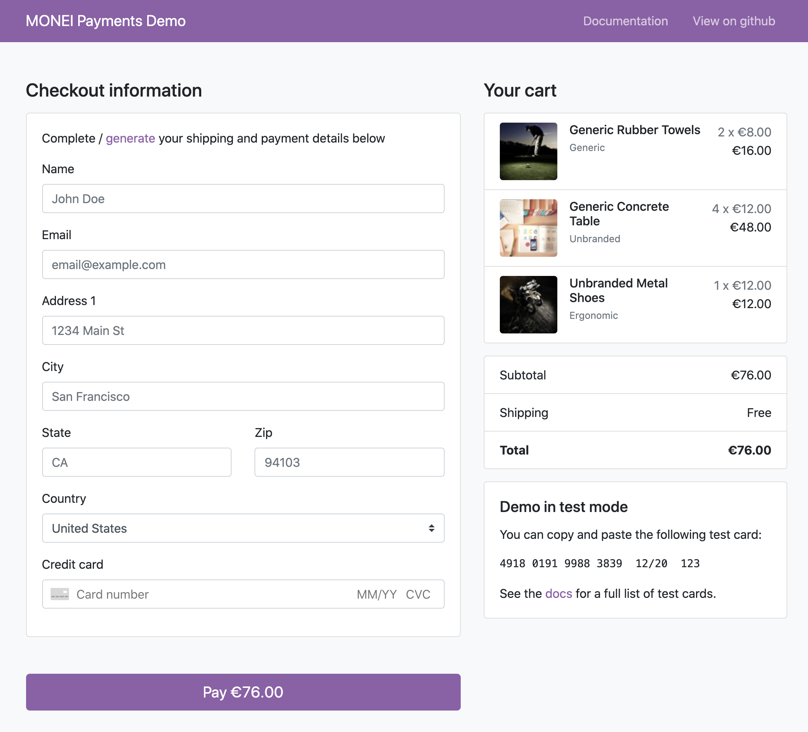

# MONEI Payments Demo

This demo features a sample e-commerce store that uses [MONEI Components](https://docs.monei.com/docs/monei-js-overview) and the [Payments API](https://docs.monei.com/api/#tag/Payments) to illustrate how to accept Credit Card, Bizum, PayPal, Apple Pay, Google Pay payments on the web.

**You can see this demo app running in test mode on [payments-demo.monei.com](https://payments-demo.monei.com).**

## Overview

This demo provides an all-in-one example for integrating with MONEI on the web:

<!-- prettier-ignore -->
|     | Features
:---: | :---
✨ | **Beautiful UI components for card payments**. This demo uses pre-built MONEI components customized to fit the app design, including the [Card In put Component](https://docs.monei.com/docs/monei-js-overview) which provides real-time validation, formatting, and autofill.
🔐 | **Dynamic 3D Secure for Visa and Mastercard.** The app automatically handles the correct flow to complete card payments with 3D Secure, whether it’s required by the card.
🚀 | **Built-in proxy for local HTTPS and webhooks.** Card payments require HTTPS and asynchronous payment methods with redirects rely on webhooks to complete transactions—[ngrok](https://ngrok.com/) is integrated so the app is served locally over HTTPS.
🔧 | **Webhook signing**. We allow for [webhook signature verification](https://docs.monei.com/docs/verify-signature), which is a recommended security practice.
📱 | **Responsive design**. The checkout experience works on all screen sizes.

## Payments Integration with MONEI Components

The frontend code for the demo is in the `public/` directory.

The core logic of the MONEI integration is mostly contained within three files:

1.  [`public/javascripts/payment-components.js`](public/javascript/payment-components.js) creates the payment experience on the frontend using [MONEI Components](https://docs.monei.com/docs/monei-js-overview).
2.  [`public/javascripts/payment-modal.js`](public/javascript/payment-modal.js) creates the payment experience on the frontend using [MONEI Payment Modal](https://docs.monei.com/docs/use-payment-modal).
3.  [`server/routes.js`](server/routes.js) defines the routes on the backend that create MONEI payments and receive payment results with the callback.

## Getting Started with Node

You’ll need the following:

- [Node.js](http://nodejs.org) >=10.0.0
- Modern browser that supports ES6.
- MONEI account to accept payments ([sign up](https://dashboard.monei.com/?action=signUp) for free).

### Running the Node Server

Copy the environment variables file from the root of the repository:

    cp .env.example .env

Update `.env` with your own [MONEI Account ID and API key](https://dashboard.monei.com/settings/api) and. These environment variables are loaded and used in [`server/config.js`](/server/config.js).

Install dependencies using npm:

    npm install

Start the local server:

    npm run start

Lastly, you will see the ngrok URL to serve our app via HTTPS. For example:

    https://<example>.ngrok.io

Use this URL in your browser to start the demo.

