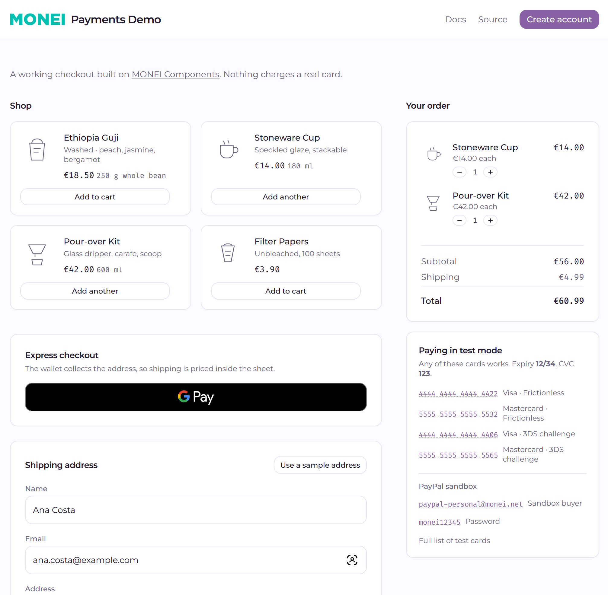

# MONEI Payments Demo

This demo features a sample e-commerce store that uses [MONEI Components](https://docs.monei.com/docs/monei-js-overview) and the [Payments API](https://docs.monei.com/api/#tag/Payments) to illustrate how to accept Credit Card, Bizum, PayPal, Apple Pay and Google Pay payments on the web.

**You can see this demo app running in test mode on [payments-demo.monei.com](https://payments-demo.monei.com).**

## Overview

This demo provides an all-in-one example for integrating with MONEI on the web:

<!-- prettier-ignore -->
|     | Features
:---: | :---
✨ | **Pre-built components for Credit Card, Bizum, PayPal, Apple Pay and Google Pay.** Card entry comes in two shapes — a single [Card Input](https://docs.monei.com/docs/payment-methods/card/) or separate number/expiry/CVC fields — both with real-time validation, formatting and autofill.
🔐 | **Dynamic 3D Secure for Visa and Mastercard.** The app handles the challenge flow when the card requires it.
🧾 | **Server-side pricing.** The browser never sends an amount. Shipping quotes are signed and the total is recomputed before the payment is created, so a tampered request is rejected rather than charged.
🔧 | **Webhook signing.** Payment results are verified with [signature verification](https://docs.monei.com/docs/verify-signature), a recommended security practice.
🎛️ | **Live configuration.** Theme, checkout flow, payment methods and cart all live in the URL, so any state you reach can be shared as a link.
📱 | **Responsive design.** The checkout works on all screen sizes.

## How the integration is put together

The demo runs on [Astro](https://astro.build) with server-side rendering. There is no client framework — the payment code is plain JavaScript, the same as you would write in a PHP, Shopify or jQuery store.

Two directories carry the integration:

1. [`src/client/checkout.js`](src/client/checkout.js) mounts [MONEI Components](https://docs.monei.com/docs/monei-js/reference/) for each payment method and handles the browser side of the flow.
2. [`src/pages/api/`](src/pages/api/) holds the server routes:
   - `payment.js` — turns a payment token into a payment
   - `redirect-payment.js` — the same call without a token, which returns a hosted payment page instead
   - `shipping-rates.js` — prices an address and issues a signed quote
   - `callback.js` — receives and verifies the webhook

The amount is decided in [`src/lib/payment.js`](src/lib/payment.js), never in the browser.

## Getting started

You will need:

- [Node.js](http://nodejs.org) >= 20.11
- A MONEI account ([sign up](https://dashboard.monei.com/?action=signUp) for free)
- [cloudflared](https://developers.cloudflare.com/cloudflare-one/connections/connect-networks/downloads/), to expose the local server over HTTPS

Copy the environment file:

    cp .env.example .env

Fill in your [Account ID and API key](https://dashboard.monei.com/settings/api) in test mode. `.env.example` explains each variable.

Install dependencies and start the dev server:

    npm install
    npm run dev

The store is now on `http://localhost:4321`, which is enough to browse it and enter a card.

### Completing a payment locally

MONEI needs to reach your machine to send the shopper back and to deliver the webhook, and it rejects non-HTTPS URLs. Run the server over HTTPS and open a tunnel to it:

    npm run dev:https      # local HTTPS on :4321
    npm run tunnel         # public HTTPS URL forwarding to it

Put the tunnel hostname in `HOSTNAME` and restart. Payments will now complete and `/api/callback` will receive webhooks.

### Test cards

Use MONEI's [test cards](https://docs.monei.com/docs/testing/). The demo surfaces the useful ones in the order summary — including a card that triggers a 3D Secure challenge, so you can see the `PENDING` receipt.

Bizum only appears for callers in Spain, because MONEI resolves the available methods from the caller's IP.

## Deployment

The demo deploys to [Vercel](https://vercel.com) with the Astro adapter. Set `MONEI_ACCOUNT_ID`, `MONEI_API_KEY` and `HOSTNAME` in the project's environment variables — `HOSTNAME` must match the host the deployment is served from, or shoppers are redirected somewhere unreachable after paying.

Apple Pay additionally requires the domain to be registered in the MONEI dashboard, and the verification file at `/.well-known/apple-developer-merchantid-domain-association` to be reachable.

## Tests

    npm test
